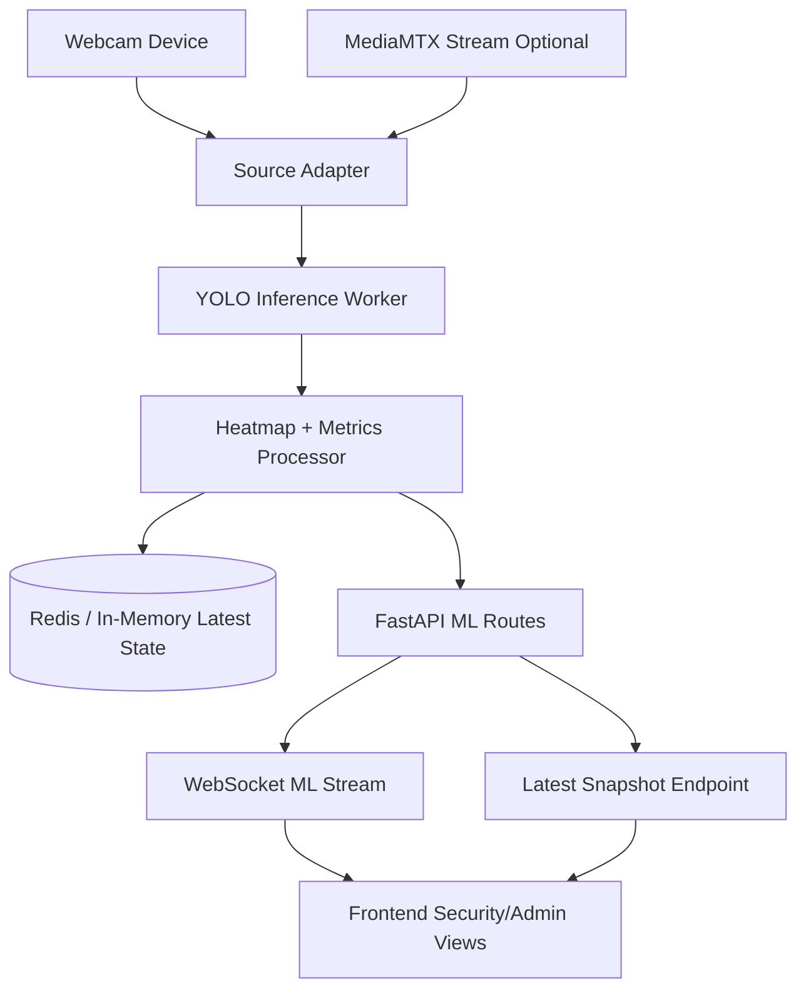

# ML Integration Plan: Local FastAPI Webcam Showcase

## Goal
Run YOLOv8 person detection locally on laptop webcam, stream live heatmap + metrics through FastAPI, and render the same data in frontend dashboards.

This document is now the implementation source of truth for v1.

---

## Locked Scope (v1)

- Testing target: webcam only.
- Backend runtime: FastAPI local environment.
- Input modes: both supported, default direct webcam.
  - `direct_webcam` (default for laptop testing)
  - `mediamtx` (optional fallback/compatibility mode)
- Auth on ML demo routes: disabled in local only.
- Persistence: Redis/in-memory only (no new DB tables/migrations in v1).
- Frontend focus: show webcam, live heatmap, and live captured specs from model payload.

Out of scope for v1:
- historical analytics persistence,
- production hardening and RBAC for ML routes,
- multi-camera orchestration beyond showcase.

---

## Showcase Success Criteria

When we run the demo locally, we must be able to see:

1. Webcam feed active.
2. Heatmap updating live from ML output.
3. Metrics updating live from ML output:
    - `person_count`
    - `average_confidence`
    - `max_confidence`
    - `processing_time_ms`
    - `inference_fps`
    - `timestamp`
    - `source_mode`
4. Stop action halts updates cleanly.

---

## End-to-End Architecture (v1)



Principles:
- One canonical payload contract across REST and WebSocket.
- Frontend reads real data only (remove random/demo metric generation).
- Existing alert dispatch flow remains intact and separate.

---

## Canonical ML Payload Contract

Use this shape for both `/latest` and websocket messages.

```json
{
  "camera_uuid": "00000000-0000-0000-0000-000000000000",
  "timestamp": "2026-04-07T12:00:00Z",
  "source_mode": "direct_webcam",
  "metrics": {
     "person_count": 3,
     "average_confidence": 0.78,
     "max_confidence": 0.91,
     "processing_time_ms": 142,
     "inference_fps": 6.8,
     "alert_triggered": false
  },
  "frame": {
     "width": 640,
     "height": 480
  },
  "heatmap": {
     "width": 32,
     "height": 24,
     "values": [0.01, 0.02, 0.40, 0.85]
  },
  "hotspot": {
     "x": 0.62,
     "y": 0.44,
     "intensity": 0.85
  }
}
```

Notes:
- `heatmap.values` can be flattened array for transport efficiency.
- Frontend reconstructs grid via `index = y * width + x`.

---

## Implementation Phases

### Phase 0: Prerequisites

1. Add ML dependencies in backend environment:
    - `ultralytics`
    - `opencv-python` (or `opencv-python-headless` for headless)
2. Ensure local services are available:
    - FastAPI backend
    - Redis
    - MediaMTX only if testing `mediamtx` mode

### Phase 1: Backend ML Module (Local)

Create modules under `backend/src/app/ml`:

1. `source.py`
    - open webcam device for `direct_webcam` (device index `0` default)
    - optional MediaMTX capture adapter for `mediamtx`
2. `inference.py`
    - load YOLO model once
    - run person-only detection
3. `postprocess.py`
    - produce heatmap grid and metrics fields
4. `state.py`
    - maintain latest snapshot in Redis/in-memory

### Phase 2: FastAPI Dev-Only ML Routes

Add router under API v1 and include it in router registration.

Required routes:

1. `POST /api/v1/ml/dev/start`
    - starts local inference session
    - accepts mode (`direct_webcam` or `mediamtx`)
2. `POST /api/v1/ml/dev/stop`
    - stops session and worker loop
3. `GET /api/v1/ml/dev/latest`
    - returns canonical payload
4. `WS /api/v1/ml/dev/stream`
    - pushes canonical payload periodically

Rules:
- these routes are available only when `ENVIRONMENT=local`.
- outside local, return blocked response.

### Phase 3: Frontend Integration

Replace demo/static logic with live ML data:

1. `HeatMap.tsx`
    - remove synthetic heat generation
    - render from API payload heatmap grid
2. `DataPanel.tsx`
    - remove random timer updates
    - show metrics from payload
3. `SecurityDashboard.tsx`
    - subscribe to ML websocket
    - pass payload to heatmap + metric components
4. `AdminDashboard.tsx` (optional but recommended)
    - mirror same live ML panel for admin showcase
5. `services/api.ts`
    - add typed ML start/stop/latest/stream helpers

### Phase 4: Local Run Workflow

1. Start backend stack.
2. Start ML session in `direct_webcam` mode.
3. Open frontend dashboard.
4. Verify webcam + heatmap + metrics update.
5. Switch to `mediamtx` mode only if needed for compatibility checks.
6. Stop session and confirm updates stop.

---

## Verification Checklist

### Backend
- ML routes only available in local env.
- Start route returns running session metadata.
- Latest route returns non-empty metrics + heatmap.
- Stream route pushes updates continuously.

### Frontend
- No fake/random metrics when stream is active.
- Heatmap is data-driven and updates without page refresh.
- Connection status is visible (connected/disconnected/stale).

### End-to-End Demo
- Webcam visible.
- Heatmap changes with movement.
- Metrics change with movement/crowd.
- Stop action halts updates cleanly.

---

## CPU/GPU Intensity Guidance (Laptop)

This workload is moderate for a single webcam with YOLOv8n, and usually does not require a GPU for v1 cadence.

### Expected intensity (1 webcam, 640x480, YOLOv8n)

| Mode | Inference cadence | Typical load profile | Practical result |
|---|---|---|---|
| CPU-only | every 2-5s | low-to-medium burst CPU usage | good for showcase |
| CPU-only | near real-time (8-15 FPS) | high sustained CPU usage | may stutter on mid laptops |
| GPU (entry laptop GPU) | every 2-5s | very low GPU usage, low CPU pressure | very smooth |
| GPU (entry laptop GPU) | near real-time | moderate GPU usage | recommended for multi-stream future |

### Rule of thumb

1. For your current scope (webcam + heatmap + metrics every 2-5 seconds), CPU-only is generally enough.
2. If you want smoother near real-time overlays or more than one stream, use GPU.
3. Biggest performance knobs:
    - lower frame resolution first,
    - then increase inference interval,
    - keep `yolov8n` for v1.

### Suggested local minimums

- CPU-only comfortable baseline:
  - 4 physical cores (or 8 threads),
  - 16 GB RAM.
- Better experience:
  - 6+ cores and/or any CUDA-capable GPU.

---

## Next Step After v1

After local showcase is stable, we can promote the same analyzer code to cloud runtime (Colab/GCP) without changing frontend payload contract.
